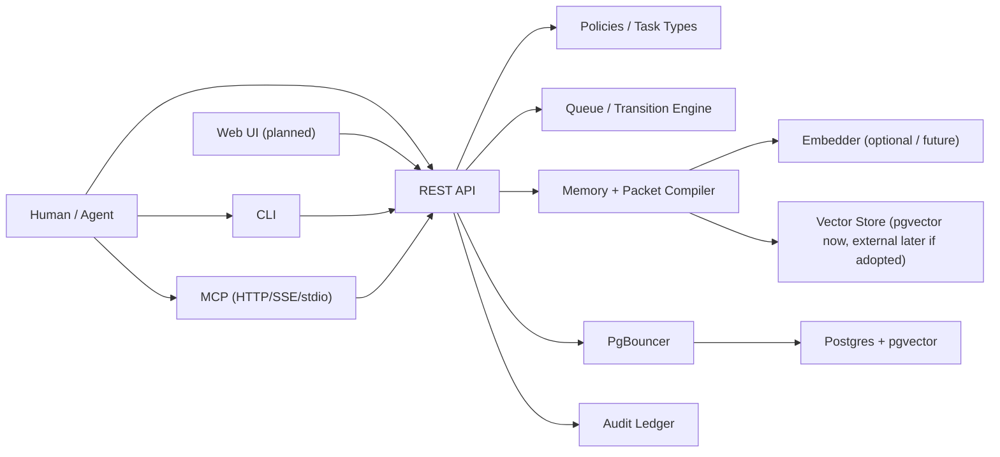

# AgenticQueue Threat Model

Status: living document

Owner: AQ-132

Method: STRIDE

Last updated: 2026-04-20

## Scope

This document models the AgenticQueue 1.0 attack surface as it exists in the
public repo today, plus the explicitly planned trust boundaries that Phase 9
must harden before public launch.

Current repo state:

- Live in repo: FastAPI app, FastMCP server, CLI, Postgres/pgvector schema,
  PgBouncer, audit ledger, bearer-token auth, capability checks, secret
  scanning, idempotency, request limits, packet/memory/learnings surfaces.
- Not live yet: a separate web UI, a standalone worker service, Sigstore
  keyless signing, GitHub Actions OIDC, and a hardened production deployment
  profile.

This is not a substitute for an external security review. It is the internal
reference that explains what we are protecting, where trust changes, what
controls already exist in the repo, and which gaps are still open.

## System Summary

AgenticQueue is a coordination plane, not an inline execution proxy. Agents and
humans interact with the platform over API, CLI, and MCP surfaces. The platform
stores graph entities, learnings, packets, policies, and audit history in
Postgres, with PgBouncer in front of the database and optional retrieval
components behind the packet/memory layer.

## Assets

| Asset | Why it matters | Primary control surface |
|---|---|---|
| Graph entities: workspaces, projects, tasks, runs, decisions, artifacts | Core coordination truth | auth, capability checks, audit ledger |
| Learnings, memory, and compiled packets | High-value context can leak repo or user secrets | secret scanning, scope limits, audit, retrieval controls |
| API tokens | Bearer tokens are the main identity primitive | HMAC hashing, scopes, revocation, expiry |
| Policies and task-type contracts | They decide what agents are allowed to do | policy loader, capability enforcement, DoD checks |
| Audit ledger | Must remain tamper-evident for trust and forensics | append-only chain, verify endpoint |
| Release artifacts and SBOMs | Public supply-chain trust | release workflow, dependency review, Scorecard |
| Secrets embedded in payloads or config | Accidental disclosure can compromise downstream systems | secret redaction middleware, private reporting process |

## Trust Boundaries

| Boundary | Status | Trust assumption | Main threats |
|---|---|---|---|
| UI -> API | Planned | Browser traffic is untrusted until authenticated and authorized by API | spoofing, CSRF/session abuse, over-broad reads |
| REST API | Current | Every caller is untrusted until bearer auth, scope checks, and capability checks pass | spoofing, tampering, DoS, privilege escalation |
| MCP HTTP/SSE | Current | Same logical trust boundary as API; MCP tool calls are still untrusted requests | tool abuse, over-broad capability use, data disclosure |
| CLI / stdio MCP | Current | Local operator tooling is trusted only to the extent of its token and role | token theft, unsafe local defaults, misuse by compromised workstation |
| Worker -> API/DB | Planned | Background execution will need the same least-privilege identity model as humans/agents | stale claims, unsafe autonomous transitions |
| API -> PgBouncer -> Postgres | Current | Database is trusted persistence, but only after API validation strips hostile input | tampering, replay, resource exhaustion |
| Packet/memory -> embedder | Optional / future | External embedder is outside the primary trust zone | prompt or secret leakage, availability loss |
| Packet/memory -> vector store | Current in-DB via pgvector; external later if adopted | Retrieval tier must never outrank policy or graph truth | disclosure, stale/poisoned retrieval |
| GitHub Actions / release pipeline | Current | CI is trusted only when workflows are pinned and artifacts are auditable | supply-chain tampering, unsigned release drift |

## Security Controls Already Shipped

### Identity and authorization

- Bearer tokens are issued once, rendered once, and stored as HMAC hashes rather
  than raw secrets in the database.
- Token scopes are enforced per route before mutation.
- Capability grants are checked against actor identity and optional scope.
- Capability denials are themselves written to the audit ledger.
- Default coding policy keeps `hitl_required: true` and explicitly declares the
  capabilities required for state transitions.

Relevant code:

- `apps/api/src/agenticqueue_api/auth.py`
- `apps/api/src/agenticqueue_api/capabilities.py`
- `task_types/coding-task.policy.yaml`
- `policies/default-coding.policy.yaml`

### Request hardening

- `Idempotency-Key` is required for mutating `/v1/*` requests and cached for
  24 hours to prevent replay drift.
- Request bodies are size-limited and rejected when JSON nesting is too deep.
- Secret scanning blocks or redacts known credential patterns before payloads
  reach persistence.
- Per-actor token-bucket rate limiting protects the REST surface from request
  floods.
- Statement timeout budgets constrain graph reads and writes.

Relevant code:

- `apps/api/src/agenticqueue_api/middleware/idempotency.py`
- `apps/api/src/agenticqueue_api/middleware/payload_limits.py`
- `apps/api/src/agenticqueue_api/middleware/secret_redaction.py`
- `apps/api/src/agenticqueue_api/middleware/rate_limit.py`
- `apps/api/src/agenticqueue_api/db.py`

### Data integrity and auditability

- Auditable ORM writes emit CREATE/UPDATE/DELETE rows with actor, trace, and
  redaction context.
- Audit rows store `chain_position`, `prev_hash`, and `row_hash` for a
  tamper-evident ledger.
- `/v1/audit/verify` exposes ledger verification.
- Queue claims use `SELECT ... FOR UPDATE SKIP LOCKED` to avoid duplicate
  claims under concurrency.

Relevant code:

- `apps/api/src/agenticqueue_api/audit.py`
- `apps/api/src/agenticqueue_api/models/audit_log.py`
- `apps/api/src/agenticqueue_api/repo/queue.py`
- `apps/api/src/agenticqueue_api/app.py`

### Deployment and supply-chain controls

- The local Compose stack uses PgBouncer in transaction mode in front of
  Postgres.
- Release automation already generates CycloneDX SBOMs and a Grype
  vulnerability report.
- OpenSSF Scorecard runs on `push` and `pull_request`.
- Dependency review blocks HIGH/CRITICAL dependency additions and GPL/AGPL
  licenses at the PR gate.

Relevant files:

- `docker-compose.yml`
- `.github/workflows/release.yml`
- `.github/workflows/scorecard.yml`
- `.github/workflows/dep-review.yml`
- `.github/dependency-review-config.yml`

## STRIDE: API Surface

This is the minimum required STRIDE table because the API is the primary trust
boundary for every other surface.

| Threat | Example scenario | Current mitigation | Residual risk |
|---|---|---|---|
| Spoofing | Attacker steals an API token and impersonates an actor | Bearer parsing, HMAC token hashing, revocation and expiry support, token scopes, capability checks | Production must override the dev fallback token-signing secret and secure operator workstations |
| Tampering | Caller mutates a task, learning, or policy outside allowed scope | Capability enforcement, task-type policy checks, DoD validation, statement timeouts, append-only audit rows | Scope design bugs or over-broad admin grants can still authorize bad writes |
| Repudiation | Actor denies changing a record or denying a capability | Audit rows include actor, trace ID, before/after snapshots, redaction metadata, and hash chaining; `/v1/audit/verify` validates the chain | Audit value depends on correct request identity and clock integrity |
| Information disclosure | Request payload includes secrets or sensitive context that would otherwise be persisted or echoed | SecretRedactionMiddleware, payload-size limits, scoped packet/memory surfaces, private disclosure path in `SECURITY.md` | Operators can still expose secrets via misconfigured env vars or debug dumps outside the API path |
| Denial of service | Oversized bodies, replay storms, or hot loops saturate the API/DB | Body caps, depth caps, per-actor rate limiting, idempotency cache, PgBouncer transaction pooling, statement timeouts | Current defaults are dev-friendly; internet-facing deployments need tighter network and ingress controls |
| Elevation of privilege | Caller with a low-privilege token attempts admin-only mutations | Capability grants, token scopes, admin-only routes, denial events logged to audit | Any actor granted `admin` or equivalent broad capabilities can still make destructive changes by design |

## STRIDE: CLI, MCP, and Packet Surfaces

| Threat | Example scenario | Current mitigation | Residual risk |
|---|---|---|---|
| Spoofing | A local tool or MCP client uses a copied bearer token | Same auth and capability checks as REST once the request reaches the app | Local token storage and shell history remain operator responsibilities |
| Tampering | MCP tool submits payloads outside contract scope | Unified FastMCP server mounts the same packet, memory, learnings, submit, approve, and audit logic used by the API | Tool naming parity does not itself guarantee safe business logic; route logic remains the real control |
| Repudiation | CLI operator claims a result came from a different client | API audit trace plus identical REST-backed semantics reduce ambiguity | CLI local execution context is not separately attested |
| Information disclosure | Compiled packets over-share repo or memory context | Packet scope limits, policy-driven capability gates, graph-first retrieval, secret scanning on mutating requests | Retrieval quality remains sensitive to sloppy `surface_area` tagging and future embedder choices |
| Denial of service | Heavy packet or memory requests fan out expensive queries | Graph and write timeouts, packet cache, prefetch width limits, PgBouncer | Future worker/UI fanout can still create pressure if caching/invalidation is mis-tuned |
| Elevation of privilege | MCP tool exposes an operation without proper capability checks | Canonical surface parity and shared app dependencies keep tool access tied to API enforcement | New tools must keep the same enforcement discipline; missing checks would widen the attack surface immediately |

## STRIDE: Data Plane and Release Pipeline

| Threat | Example scenario | Current mitigation | Residual risk |
|---|---|---|---|
| Spoofing | A fake release artifact is presented as official | Release job runs in GitHub Actions and publishes SBOM + vuln artifacts; Scorecard runs continuously | Sigstore keyless signing and OIDC are still open work, so published artifacts are not yet cryptographically signed |
| Tampering | Database rows or audit history are altered after the fact | Audit hash chain plus verify endpoint; ORM hooks capture before/after snapshots; queue claims lock rows atomically | Direct database access outside the app remains highly privileged; production role separation still matters |
| Repudiation | Maintainer disputes what shipped in a release | Release workflow updates notes with supply-chain summary and attached artifacts | No provenance attestation yet; SLSA L2 remains pending |
| Information disclosure | SBOM, vuln report, or release artifact leaks secrets | Secret scanning blocks known secrets on API submits; repo policy forbids committed secrets | CI and release workflows still depend on correct repo hygiene and secret handling outside the submit path |
| Denial of service | DB saturation or queue thrash prevents claims/submits | PgBouncer, statement timeouts, `SKIP LOCKED`, retry and idempotency controls | Current Compose profile is local-dev oriented and exposes ports directly |
| Elevation of privilege | Compromised workflow or maintainer token publishes malicious assets | Pinned actions in Scorecard workflow and dependency review reduce drift | Release workflow still uses `github.token`; OIDC/Sigstore hardening is pending |

## Known Gaps and Explicit Assumptions

These are real gaps, not hidden footnotes:

1. The repo still includes development defaults that are not acceptable for an
   internet-facing deployment.
   - `AGENTICQUEUE_TOKEN_SIGNING_SECRET` falls back to a dev secret in
     `apps/api/src/agenticqueue_api/config.py`.
   - `docker-compose.yml` publishes fixed local credentials and open ports for
     Postgres, PgBouncer, and API.

2. Dependency review only runs on pull requests, while the current pre-launch
   operating mode allows direct pushes to `main`.
   - That means dependency-review is not yet a universal gate on every change
     that lands on `main`.

3. Release hardening is incomplete.
   - SBOM and vulnerability reporting are present.
   - Sigstore keyless signing, provenance, and GitHub Actions OIDC are still
     pending work.

4. UI and worker surfaces are modeled here before they are fully implemented.
   - This is intentional so Phase 9 hardening can review the future trust
     boundaries early.
   - Their mitigations become binding only when code lands.

5. The vector-store boundary is currently internal to Postgres via pgvector.
   - If a future external vector system is adopted, this document must be
     updated because the trust boundary changes materially.

## Reviewer Checklist

When this document changes, re-check:

- Are token, capability, and audit claims still true in code?
- Do request limits and secret-scanning defaults still match implementation?
- Does the release pipeline description still match the actual workflows?
- Did a new surface appear without a trust-boundary entry here?
- Did a pending gap become shipped and need to move from "assumption" to
  "mitigation"?

## Evidence

Primary implementation evidence:

- `apps/api/src/agenticqueue_api/app.py`
- `apps/api/src/agenticqueue_api/auth.py`
- `apps/api/src/agenticqueue_api/capabilities.py`
- `apps/api/src/agenticqueue_api/audit.py`
- `apps/api/src/agenticqueue_api/db.py`
- `apps/api/src/agenticqueue_api/repo/queue.py`
- `apps/api/src/agenticqueue_api/mcp/server.py`
- `apps/api/src/agenticqueue_api/middleware/`
- `apps/api/src/agenticqueue_api/models/audit_log.py`
- `docs/surface-1.0.md`

Primary test evidence:

- `tests/unit/test_auth.py`
- `tests/unit/test_capability_enforcement.py`
- `tests/unit/test_audit_log_worm.py`
- `tests/integration/test_audit_chain_verify.py`
- `tests/integration/test_idempotency_integration.py`
- `tests/integration/test_secret_redaction_integration.py`
- `tests/integration/test_timeout_pool_health.py`
- `tests/security/firewall/`
